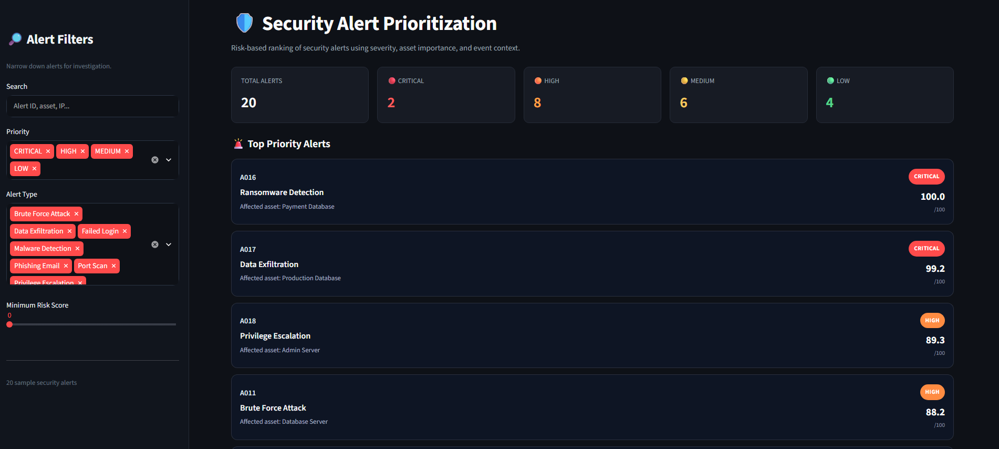
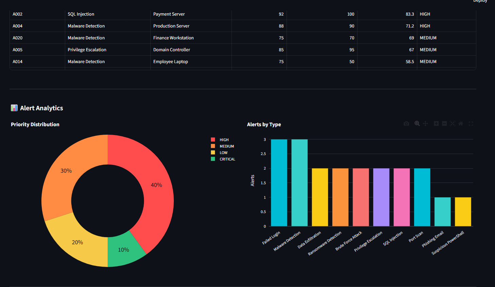
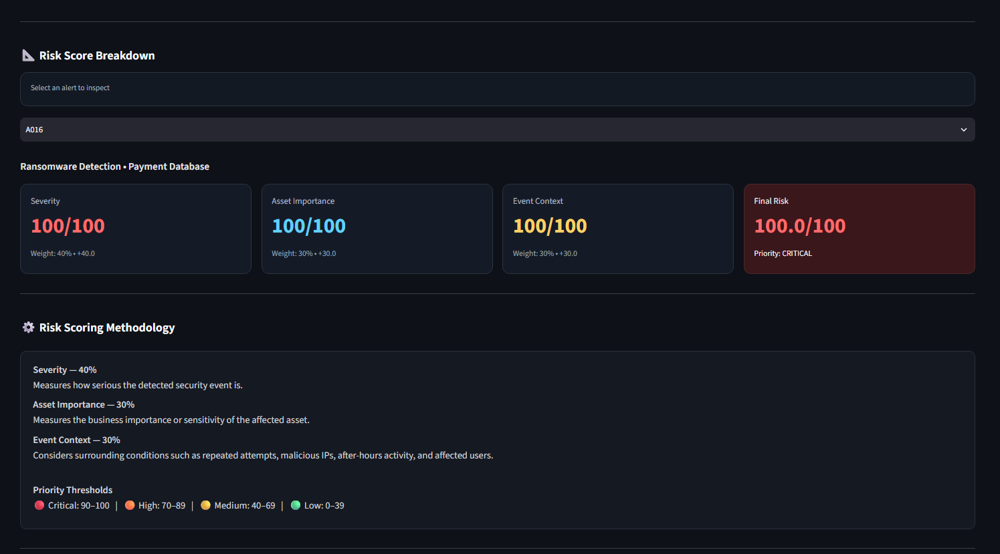

# Security Alert Prioritization Dashboard

A hands-on SOC-style mini-project that I created as part of an internship assignment to assist security analysts in triaging their alerts more quickly by use of a weighted risk score.
The dashboard processes raw security alerts and outputs a final risk score and assigns a priority level to each alert, and visualizes the data in an easy to understand Streamlit application to more quickly triage security alerts.

## Internship Task Context

The main objective was to demonstrate what a typical analyst scenario looks like when they get lots of alerts together and have to make sure that they are acted upon in the proper order. Rather than having a person going through alerting one-by-one, this project built some type of consistent rating that should push the alerting with higher risk level up.

## What This Project Does

- Reads sample alert data from a CSV file.
- Calculates a weighted risk score for each alert.
- Assigns priority levels: `CRITICAL`, `HIGH`, `MEDIUM`, `LOW`.
- Provides filter/search controls for investigation.
- Shows top-priority alerts first.
- Displays analytics charts and score breakdown cards.

## Risk Scoring Logic

The final score is computed on a 0-100 scale:

`Risk Score = (Severity x 0.40) + (Asset Criticality x 0.30) + (Event Context x 0.30)`

### Event Context Inputs

Event context increases based on signals such as:
- Number of failed attempts
- Malicious IP flag
- After-hours activity
- Number of affected users

### Priority Thresholds

- `CRITICAL`: 90-100
- `HIGH`: 70-89
- `MEDIUM`: 40-69
- `LOW`: 0-39

## Screenshots

### 1) Dashboard Home



### 2) Alert Analytics View



### 3) Risk Score Breakdown View



## Tech Stack

- Python
- Streamlit
- Pandas
- Plotly

## Project Structure

```text
security-alert-prioritization/
|-- app.py
|-- scoring_engine.py
|-- requirements.txt
|-- data/
|   |-- alerts.csv
|-- assets/
|   |-- homepage.png
|   |-- graphpage.png
|   |-- scorebreakdownpage.png
```

## Run Locally

1. Clone or open the project folder.
2. Install dependencies:

```bash
pip install -r requirements.txt
```

3. Start the app:

```bash
streamlit run app.py
```

4. Open the local URL shown in terminal (usually `http://localhost:8501`).

## Notes

- This project uses a sample dataset for demonstration.
- Scoring weights can be tuned based on SOC policy.
- The code is split into:
  - `app.py` for UI + data flow
  - `scoring_engine.py` for scoring logic

## Future Improvements

- Export prioritized alerts to CSV/PDF.
- Integrate real-time alert ingestion from SIEM.
- Add authentication for role-based access.

---

Developed as an internship task to demonstrate risk-based alert triage and dashboard reporting.
